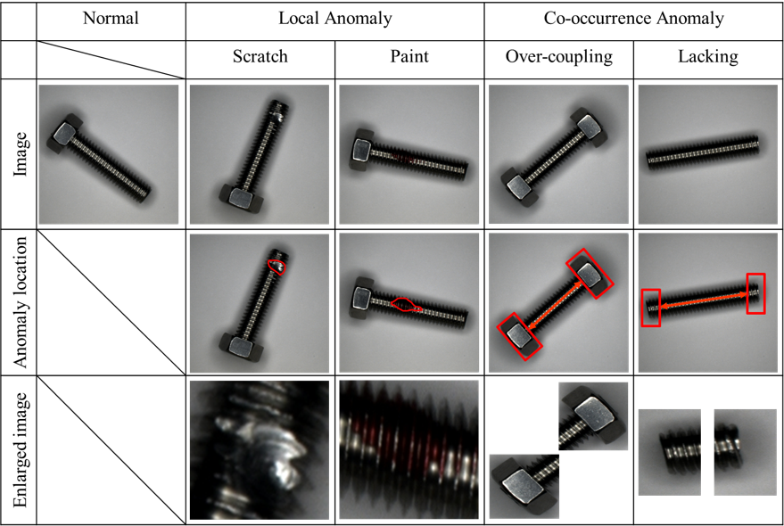

# Co-occurrence-Anomlay-Screw-Dataset

This repository contains "Co-occurrence Anomlay Screw Dataset" for anomaly detection, including local anomalies and co-occurrence anomalies.

The dataset is available is this [[Link](https://drive.google.com/drive/folders/1yeampzTiB4uoTmmqIZkeCdMIXGujl3cU?usp=sharing)].

